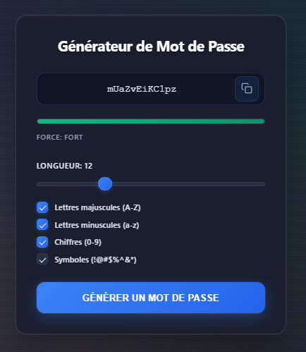

# Password_Generator

## Description
Application web permettant de générer des mots de passe aléatoires en fonction de critères sélectionnés par l’utilisateur (longueur, types de caractères, etc.).  
Ce projet est le **dix-neuvième** du défi personnel **100 projets en 2026**.

---

## Objectifs du projet
- Générer des chaînes de caractères aléatoires
- Manipuler des options dynamiques (checkbox)
- Travailler la logique conditionnelle
- Mettre en place un indicateur de force simple
- Concevoir une interface claire et fonctionnelle

---

## Plateforme
- Web (navigateur)

---

## Technologies utilisées
- HTML
- CSS
- JavaScript

---

## Fonctionnalités
- Choix de la longueur du mot de passe
- Inclusion optionnelle :
  - Lettres majuscules
  - Lettres minuscules
  - Chiffres
  - Symboles
- Génération aléatoire
- Bouton pour copier le mot de passe
- Indicateur visuel de force

---

## Design & UX
- Interface moderne et épurée
- Mot de passe affiché en grand
- Options claires et bien espacées
- Bouton générer visible
- Responsive (mobile et desktop)

---

## Captures d’écran

---

## Ce que j’ai appris
- Utilisation de `Math.random()`
- Manipulation de chaînes de caractères
- Gestion des événements utilisateur
- Structuration d’une logique conditionnelle
- Amélioration de l’UX avec un indicateur visuel

---

## Améliorations possibles
- Génération cryptographiquement plus sécurisée
- Historique des mots de passe générés
- Personnalisation avancée des critères
- Mode sombre

---

## Statut du projet
 **Projet terminé**
